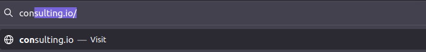

# networking_assignment
Hero Vired DevOps Assignment for Networking Concepts

>#### Question 1: 
>
>* Deployed a website on localhost using nginx. Created a DNS name for this website as ‘consulting.io’. Created a HTML & CSS File to achieve this.
>

>Then it is important to adjust the firewall to allow nginx to work smoothly. Remember sometimes apache 2 and Nginx gives problem when trying to work together. So it is important to run either one of them.

>

>

>

>

>

>

>#### Question 2: 
>
>* This is a Python script to check the status of the subdomains which are up or down. The script automatically checks the status every min and updates it in tabular format on the screen

>

>* A detailed documentation is part of the code.

>

>